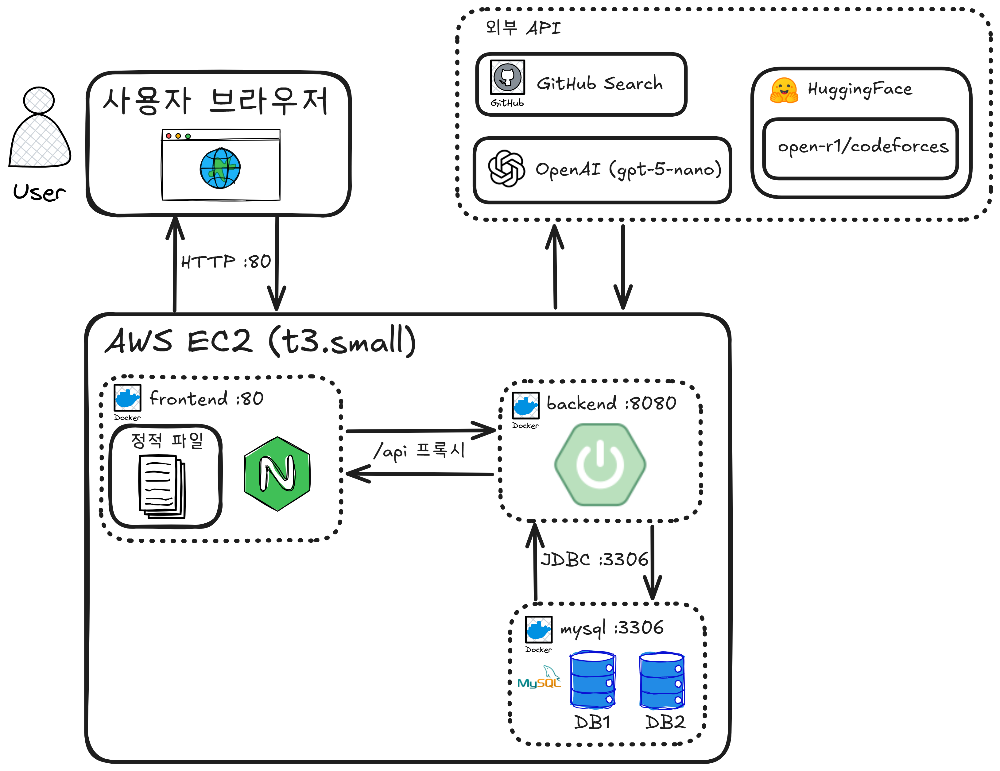
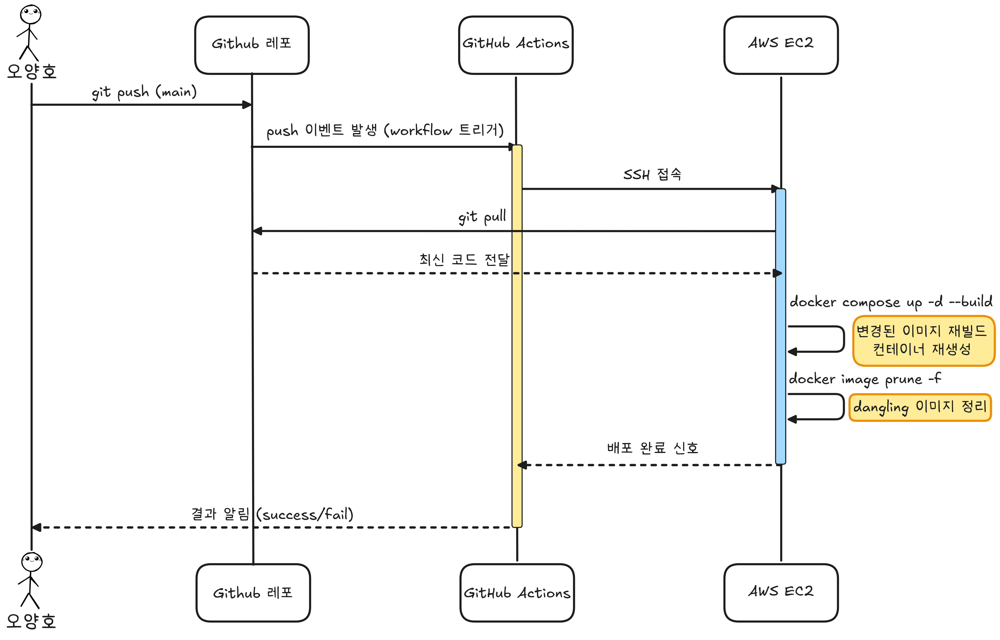

# README.md

더 많은 문서: [Notion 페이지](https://moored-bookcase-a10.notion.site/AlgoList-361b855637d9803ea173c8d15cc1e005)

---
## 좋은 뉴스

프로젝트를 배포했습니다!
피드백 환영합니다.

링크: http://algolist.kro.kr/

---
## 프로젝트 소개

**프로젝트 기간:** [2026/05/22~2026/06/23]

저희 프로젝트는 체계적인 알고리즘 학습을 위해 흩어져 있는 학습 도구를 한 곳에 모은 서비스입니다.

**해결하고자 하는 문제:**

저의 알고리즘 학습 루틴을 소개합니다:
1. 노션을 이용한 복습 주기 관리
   - 문제 풀이 시간 측정을 기반으로 문제의 등급 설정
   - 등급 별로 1일, 4일, 한 달 간격으로 복습
2. 백준허브 웹 익스텐션을 이용한 소스코드 관리
   - 같은 문제를 여러 번 반복 풀이
   - 같은 문제를 다양한 접근법으로 풀이
   - 위 과정에서 생긴 풀이 소스코드를 깃허브 레포지토리에 저장 및 관리
3. 백준, SWEA 등의 다양한 플랫폼 문제 풀이

이러한 방식으로 학습하다 보면 노션, 깃허브, 백준 등 다양한 플랫폼을 사용해야 합니다.
도구를 옮겨 다니면서 필연적으로 학습에 쏟아야 할 시간을 낭비하게 됩니다.
또한 계속 다른 화면을 보면서 주의와 집중이 분산됩니다.
뇌 과학적으로는 이를 컨텍스트 스위칭 비용이 발생한다고 합니다.

저희 프로젝트 AlgoList는 문제 검색 및 AI 번역, 복습 주기 관리, 풀이 코드 보관을 한 사이트에서 해결하도록 하여 이러한 문제를 해결하고자 합니다.

---
## 주요 기능

### 1. 문제 검색 & 통합 수집

- 백준·코드포스 문제를 한 곳에서 검색
- **백준**: 백준허브가 생성한 README를 GitHub Search API로 수집 (검색 결과 1,000건 제한을 난이도별 분할로 우회)
- **코드포스**: CC-BY-4.0으로 공개된 데이터셋(HuggingFace)에서 수집
- 초반엔 배치로 대량 적재하고, 검색 시 DB에 없는 문제는 온디맨드로 실시간 수집

### 2. AI 번역

- 영어로 된 코드포스 문제를 한국어로 자동 번역 (gpt-5-nano)
- 코드·수식은 placeholder로 보호해 번역 중 손상 방지
- placeholder 유실이 감지되면 자기 교정 루프로 재번역 (최대 2회)

### 3. 복습 주기 관리

- 문제마다 등급을 매기고, 등급에 따라 복습 주기를 차등 산정 (예: 1일 · 4일 · 한 달)
- 오늘 복습할 문제를 모아서 제공

### 4. 내 문제 관리

- 풀고 싶은/푼 문제를 내 목록에 추가·관리 (개별·다중 삭제)
- 문제별 풀이 소스코드 보관

### 5. 사용자 인증 & 관리

- Spring Security 기반 세션 인증 (회원가입 · 로그인)
- 어드민 기능: 유저 조회, 문제 수집 배치 트리거

---

## 시스템 아키텍처

### 런타임 아키텍처

### 배포 아키텍처

---

## 팀원 및 역할

**인원:** 2명  /  **팀장:** 오양호  /  **팀원:** 박민혁

**역할:**

1. 오양호:
    - 문서화 리드
    - 화면 설계
    - 요구사항 정의
    - ERD 설계
    - 그림
    - 문제 데이터 수집 (BOJ / codeforces)
    - 문제 CRUD
    - 문제 검색
    - AI 번역
    - 도커 컨테이너화
    - 배포 및 CD
2. 박민혁:
    - Spring Security를 사용한 세션 인증
    - 유저 CRUD
    - 유저 관리 기능(유저 조회, 권한 변경, 계정 정지)
    - 소스코드 CRUD
    - 복습 주기 관리

---

## 프로젝트 기술 스택

**Frontend:** Vue.js  /  HTML  /  CSS  /  JavaScript

**Backend:** Spring  /  Spring Boot  /  Spring Security  /  Swagger

**DB:** MySQL  /  MyBatis

**AI:** OpenAI gpt-5-nano

**Infra:** AWS EC2(t3.small)  /  nginx

---

## 프로젝트 환경

### 서비스 환경

**배포 URL:** http://algolist.kro.kr/

**Cloud:** AWS EC2 (t3.small · 2 vCPU / 2 GiB RAM · Ubuntu)

**Storage:** EBS 30 GiB + Swap 2 GiB

**컨테이너:** Docker / docker compose — nginx + 프론트, 백엔드(Spring Boot), MySQL 3개 컨테이너

**Web Server:** nginx (정적 파일 서빙 + 리버스 프록시)

**CD:** GitHub Actions (main 브랜치 push 시 EC2 자동 배포)

### 개발 환경

**OS:** Window 11

**STS:** 5.0.1.RELEASE

**Spring Boot:** 4.0.6

**JDK:** 21

**MySQL:** 8.0.45

---

## 디렉토리 구조

도메인(기능) 중심 — package-by-feature

---
## 실행 방법

**서비스 이용** → http://algolist.kro.kr/ 접속

**로컬 실행** (Docker 필요)
1. git clone [URL]
2. 루트에 `.env` 생성 (DB_PASSWORD, SSAFY_GMS_API_KEY, GITHUB_TOKEN)
3. `docker compose up -d --build`