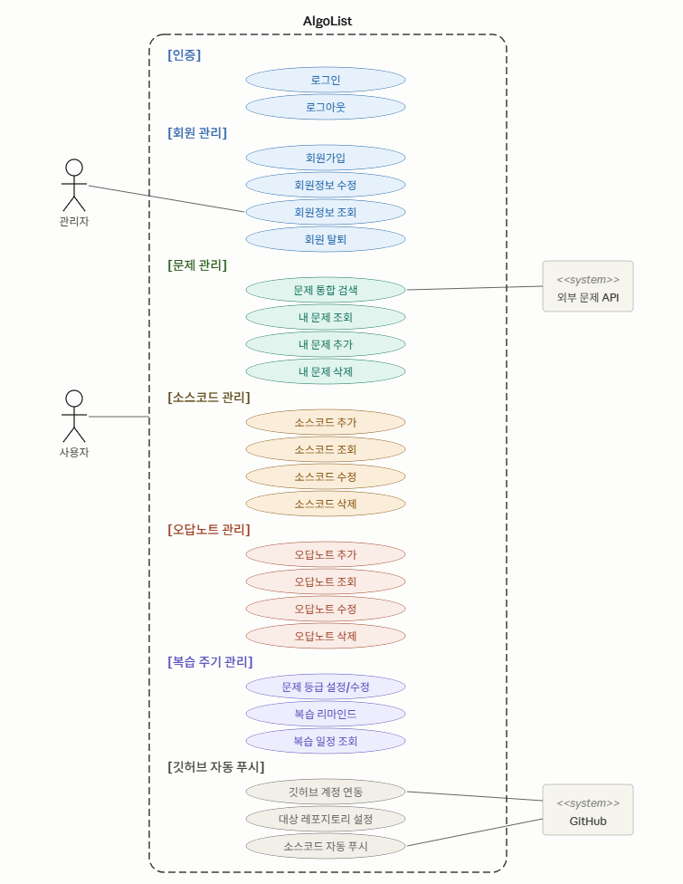

# AlgoList

> **알고리즘 학습 및 문제 관리 플랫폼**  
> 알고리즘 문제를 풀고, 소스코드를 관리하며, 복습을 효율적으로 추적할 수 있는 통합 학습 플랫폼

**Version:** 1.1 | **Last Updated:** 2026.05.15

---

## 프로젝트 개요

AlgoList는 알고리즘 학습자들을 위한 종합 관리 플랫폼입니다. 사용자가 풀이한 알고리즘 문제, 작성한 소스코드, 오답 분석, 복습 일정을 한 곳에서 관리할 수 있으며, GitHub과의 자동 연동으로 코드 관리까지 효율화됩니다.

### 주요 특징

- **회원 관리** - 안전한 인증 및 사용자 정보 관리
- **문제 관리** - 알고리즘 문제 검색, 추가, 수정, 삭제
- **소스코드 관리** - 문제별 코드 저장 및 버전 관리
- **오답노트** - 틀린 문제 분석 및 학습 자료 정리
- **복습 추적** - 문제 난이도 설정 및 복습 일정 자동 추천
- **GitHub 연동** - 작성한 코드 자동 푸시 및 관리

---

## 시스템 아키텍처

### Use Case Diagram



**주요 액터:**
- **관리자 (Admin)** - 시스템 운영 및 사용자 관리
- **사용자 (User)** - 문제 풀이 및 학습 활동

**외부 시스템:**
- **GitHub API** - 소스코드 자동 푸시
- **외부 문제 API** - 알고리즘 문제 정보 조회

---

## Work Breakdown Structure (WBS)


### Sprint 구성

프로젝트는 3개의 Sprint로 구성되며, 각 Sprint마다 Frontend, Backend, API 연동, 데이터베이스 설계 등의 작업을 병렬로 진행합니다.

**주요 작업 항목:**
- 회원 인증 시스템 (AUTH)
- 회원 관리 기능 (MEM)
- 문제 관리 기능 (PROB)
- 소스코드 관리 (SRC)
- 오답노트 기능 (NOTE)
- 복습 추적 시스템 (REV)
- GitHub 연동 (GIT)

---

## 핵심 기능

### 1. 회원 관리
- 사용자 회원가입 및 인증
- 회원정보 수정 및 조회
- 회원 탈퇴

### 2. 문제 관리
- 문제 통합 검색 (키워드, 난이도, 카테고리)
- 내 문제 목록 조회
- 새로운 문제 추가
- 문제 수정 및 삭제

### 3. 소스코드 관리
- 문제별 코드 저장 및 조회
- 소스코드 버전 관리
- 여러 언어 지원 (Python, Java, C++, JavaScript 등)
- 코드 스타일 검증

### 4. 오답노트
- 틀린 문제 자동 분류
- 풀이 과정 및 해결책 기록
- 카테고리별 분석 및 통계

### 5. 복습 추적
- 문제별 난이도/등급 설정
- 복습 필요 문제 자동 추천
- 복습 리마인드 알림
- 복습 일정 조회

### 6. GitHub 연동
- GitHub 저장소 자동 연동
- 소스코드 자동 푸시
- 대상 레포지토리 설정 및 관리
- OAuth 인증

---

## 기술 스택

### Frontend
- React / Vue.js
- TypeScript
- Tailwind CSS
- Redux / Pinia

### Backend
- Node.js / Python / Java
- Express / Flask / Spring Boot
- JWT 인증
- REST API

### Database
- PostgreSQL / MySQL
- Redis (캐싱)

### External API
- GitHub API
- 알고리즘 문제 데이터 API

### DevOps & Tools
- Docker
- Git/GitHub
- CI/CD Pipeline

---

## 요구사항 정의

### Must Have (필수 기능)
- [x] 회원 인증 및 관리 (AUTH-001, AUTH-002)
- [x] 회원정보 조회/수정/탈퇴 (MEM-001, MEM-002, MEM-003, MEM-004)
- [x] 문제 검색/추가/수정/삭제 (PROB-001, PROB-002, PROB-003, PROB-004)
- [x] 소스코드 추가/조회/수정/삭제 (SRC-001, SRC-002, SRC-003, SRC-004)
- [x] 오답노트 추가/조회/수정/삭제 (NOTE-001, NOTE-002, NOTE-003, NOTE-004)
- [x] 복습 추적 기능 (REV-001, REV-002)
- [x] GitHub 연동 (GIT-001, GIT-002, GIT-003)

### Should Have (추가 기능)
- [ ] AI 기반 문제 추천
- [ ] 실시간 협업 기능
- [ ] 고급 통계 및 분석
- [ ] 복습 일정 최적화 알고리즘

---

## 시작하기

### 전제 조건
- Node.js v16+
- Python 3.8+
- Docker
- GitHub 계정

### 설치 및 실행

```bash
# 저장소 클론
git clone https://github.com/your-repo/algolist.git
cd algolist

# 의존성 설치
npm install

# 환경 변수 설정
cp .env.example .env

# 개발 서버 실행
npm run dev

# 프로덕션 빌드
npm run build
```

### GitHub 연동 설정

1. GitHub에서 OAuth App 등록
2. `.env` 파일에 `GITHUB_CLIENT_ID`, `GITHUB_CLIENT_SECRET` 추가
3. 애플리케이션 재실행

---

## 문서

- [API 문서](./docs/api.md)
- [데이터베이스 스키마](./docs/schema.md)
- [개발 가이드](./docs/development.md)
- [배포 가이드](./docs/deployment.md)

---

## 기여하기

AlgoList 개선에 참여하고 싶으신 가요? 아래 단계를 따라주세요.

1. Fork the repository
2. Create your feature branch (`git checkout -b feature/AmazingFeature`)
3. Commit your changes (`git commit -m 'Add some AmazingFeature'`)
4. Push to the branch (`git push origin feature/AmazingFeature`)
5. Open a Pull Request

---

## 라이선스

이 프로젝트는 MIT 라이선스 하에 있습니다. [LICENSE](./LICENSE) 파일을 참고하세요.

---

## 팀 멤버

- **오양호**
- **박민혁**

---

**Made for Algorithm Learners**
