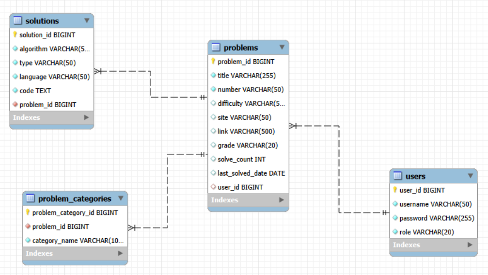

# README.md

더 많은 문서: [Notion 페이지](https://moored-bookcase-a10.notion.site/README-md-368b855637d980aca92ac9938b200355)

## 프로젝트 소개

**프로젝트 기간:** [2026/05/22~]

[]

---

## 주요 기능

[]

---

## 시스템 아키텍처

### 서비스 아키텍처

[]

### 개발 단계 아키텍처


(나중에 draw.io로 더 예쁘게 그리면 좋음)

---

## ERD



---

## API 문서 링크 (Swagger)

**개발:** [http://localhost:8080/swagger-ui/index.html](http://localhost:8080/swagger-ui/index.html)

**서비스:** []

---

## 팀원 및 역할

**인원:** 2명  /  **팀장:** 오양호  /  **팀원:** 박민혁

**역할:**

1. 오양호:
    - 문서화 리드 (문서 체계 설계·작성)
    - 문제 CRUD
2. 박민혁:
    - Spring Security를 사용한 세션 인증
    - 유저 CRUD

---

## 프로젝트 기술 스택

**Frontend:** Vue.js  /  HTML  /  CSS  /  JavaScript

**Backend:** Spring  /  Spring Boot  /  Spring Security  /  Swagger

**DB:** MySQL  /  MyBatis

**AI:** ChatGPT5.2

**Infra:** AWS EC2  /  nginx

---

## 프로젝트 환경

### 서비스 환경

커밍 쑨..

### 개발 환경

**OS:** Window 11

**STS:** 5.0.1.RELEASE

**Spring Boot:** 4.0.6

**JDK:** 21

**MySQL:** 8.0.45

---

## 디렉토리 구조

도메인(기능) 중심 — package-by-feature

관심사 별로 패키지를 분리하되, 과한 분리는 하지 말 것.

---

## 프로젝트 실행 방법

1. 작업 폴더에서 git bash 또는 터미널 접속 후:

    ```bash
    git clone [URL]
    ```

2. frontend 폴더에서 터미널 접속 후:

    ```bash
    npm install   # 최초 1회: 의존성 설치 (node.js 사전 설치 필요)
    npm run dev
    ```

    화면에 나온 URL을 Ctrl + 클릭으로 접속하거나, 브라우저에 해당 URL로 접속

3. STS 실행 후, backend를 Maven 프로젝트로 import

4. Spring Dashboard에서 프로젝트 실행

5. MySQL 접속 후, `src/main/resources`에 있는 schema.sql 실행
